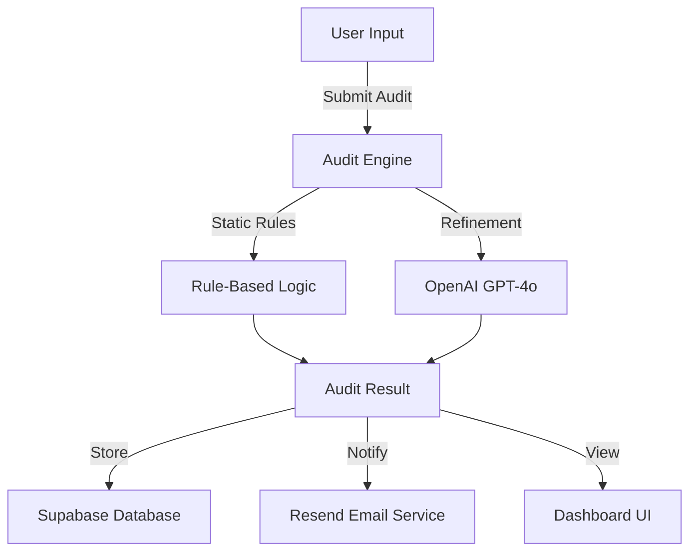

# Architecture

## Technology Stack Rationale
- **TypeScript**: Chosen for its type safety, which is critical when handling financial calculations and audit data.
- **Supabase**: Provides a scalable PostgreSQL database with minimal configuration, perfect for storing audit logs.
- **OpenAI (GPT-4o)**: Used for high-level strategic reasoning that goes beyond simple rule-based calculations.
- **Resend**: A developer-friendly email API for delivering reports.

## Data Flow Diagram

## Core Components
1. **Audit Logic**: Located in `src/auditEngine.ts`, handles all calculations.
2. **Data Clients**: `src/lib/supabaseClient.ts` and `src/lib/emailService.ts`.
3. **Integration Layer**: Combines rule-based logic with AI insights.
